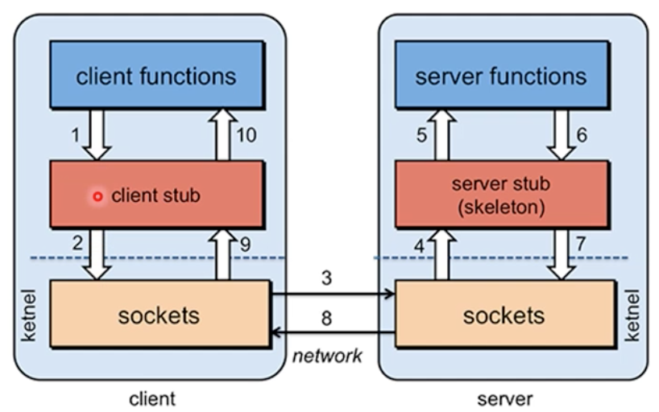
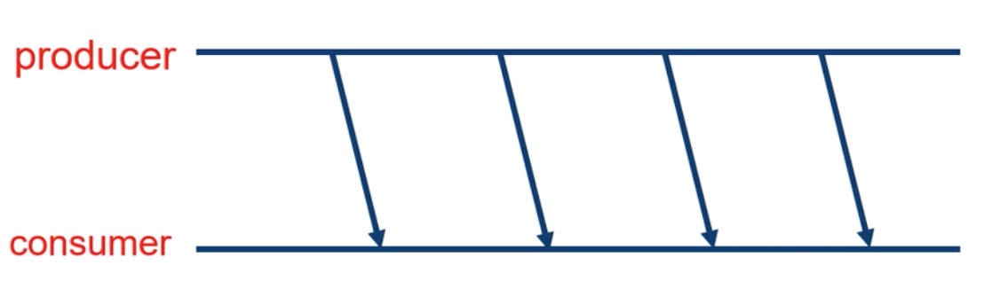
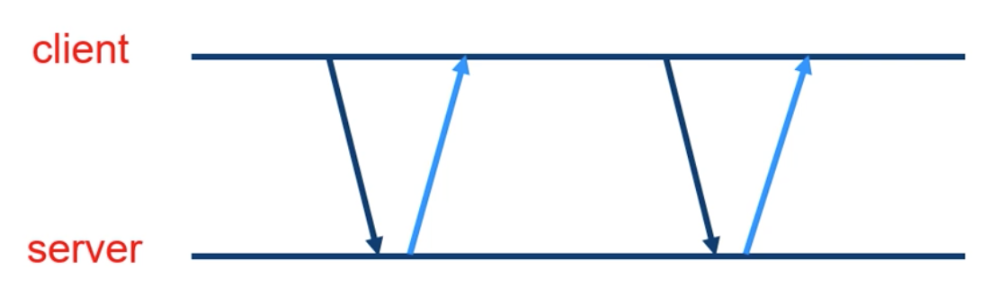

# Week4

## Remote Procedure Calls (RPC)

-   prodcedure == function

-   프로세스와 네트워크 시스템 사이의 추상적인 호출

## Local procedure call

하나의 머신 안에서 실행가능한 함수를 call 하는 것

```
int sum(int a, int b){
    int k;
    k = a + b;
    return k;
}

int main(){
    int m;
    m = sum(1,2);
    return (0);
}
```

코드에서 sum이 LPC에 해당되고 컴파일이 되면서 스택에 파라미터, PC에 sum의 주소, 리턴주소 k가 들어간다

그렇다면 RPC는 네트워크로 물려진 다른 머신에서 실행가능한 함수를 call하는 것이다.

### RPC를 활용한 효율적인 데이터 처리



### Pipes

한 쪽에서 다른 쪽으로 정보가 흘러간다


유닉스 명령어 ls | wc -w를 실행 할 경우 흐름을 보여준다

명령어를 해석하면 ls를 활용하여 가져온(stdout) 현재 디렉토리 리스트가 |(pipeline)을 통해서 wc -w 명령어의 stdin으로 들어가게 된다

## Communication Model

### Cooperation Model

1. Producer-Consumer Model



producer의 일방적인 제공

2. Client-Server Model



클라가 뭔가를 서버에 주면 서버가 클라한테 반환하는 것

통신 channel을 sockets, RPC, Pipes로 구축하고 Request에 따른 server processing 과정을 거치고 Reply하는 형식으로 간다
